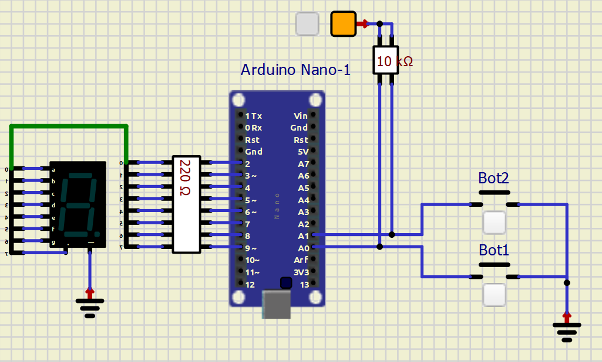

# TP4

## Uso de Display. 

Utilizando un Arduino Nano (`atmega328p`), `1 display 7 seg` y `2 Pulsadores` se pide:

1. Realizar un contador de `0` a `9` en decimal que se incremente al presionar un **pulsador**. Mostrar
el resultado de la cuenta en un **display**.

2.  Agregar al problema anterior un **pulsador** que decremente el número.

> Nota: Todos los pulsadores `deben` tener habilitada la resistencia de `pull-up`.

> el incremento o decremento debe de producirse en una unidad por pulsación. Utilice `debouncing` 

> Conecte una resistencia a cada segmento del display.

---

## Para poder realizar el trabajo

Tener en cuenta que los displays pueden ser anodo o catodo común, esto deberá tenerse en cuenta
para conectar el común de los displays o bien a GND o bien a +Vcc para lograr el encendido.
Opcionalmente, se puede utilizar un `decodificador BCD a 7 segmentos`, **CD4511(CMOS)** o
**SN7447(TTL)**, esto simplifica la codificación pero aumenta la complejidad de el circuito.
## ¡USAR LOS PINES INDICADOS NO CAMBIARLOS!

``` C
PC0 -> BOTON 1 
PC1 -> BOTON 2 
PC2 -> BOTON 3 
PC3 -> BOTON 4

PD2 -> SEGMENTO A   
PD3 -> SEGMENTO B 
PD4 -> SEGMENTO C
PD5 -> SEGMENTO D 
PD6 -> SEGMENTO E 
PD7 -> SEGMENTO F
PB0 -> SEGMENTO G
PB1 -> SEGMENTO DP

```
## Pinout


## Circuito



---

#INFORME

``` C
#define bot1 ((PINC>>PC0)&0x01)
#define bot2 ((PINC>>PC1)&0X01)
``` 

Empezamos creando las macros para facilitar la lectura del código en este caso se crearon macros para los unicos dos botónes que se usan en la consigna.

``` C
uint8_t Tabla_Digitos_7seg[] = {
  0b11111100,//0	
  0b00011000,//1	
  0b01101101,//2	
  0b00111101,//3	
  0b10011001,//4	
  0b10110101,//5	
  0b11110101,//6	
  0b00011100,//7	
  0b11111101,//8	
  0b10011101 //9	
};
```

Como se ve en la referencia acá se creó un vector con cada numero que deseamos mostrar en nuestro display en este caso del 0-9.

``` C
int16_t cont = 0;
```

En esta parte del código se hace una variable llamada cont (contador) que es la que va a ir dirigiendo cada caso del display osea que en el momento que el contador llege a 5 el display mostrará el numero 5 y así con cada uno de los numeros en la consigna.

``` C
DDRC &=~(1<<PC0);
DDRC &=~(1<<PC1);

PORTC |=(1<<PC0);
PORTC |=(1<<PC1);

DDRD |=(1<<PD2);
DDRD |=(1<<PD3);
DDRD |=(1<<PD4);
DDRD |=(1<<PD5);
DDRD |=(1<<PD6);
DDRD |=(1<<PD7);
DDRB |=(1<<PB0);
DDRB |=(1<<PB1);
```

Acá definimos nuestras entradas, salidas y resistencias de pull up para nuestros botónes.

``` C
while (1)
{

    if (bot1 == 0)
    {
        _delay_ms(100);
        if (bot1 == 0)
        {
            cont++;
            cont %= 10;
        }
    }

    if (bot2 == 0)
    {
        _delay_ms(100);
        if (bot2 == 0)
        {
            cont--;
            if (cont < 0)
            {
                cont = 9;
            }
        }
    }
```
En esta parte está englobado todo lo que hacen los botones. En primer parte si el botón 1 está accionado lo que va a hacer a grandes rasgos es ir incrementando los numeros en el display hasta que llega a 9 y si se sigue incrementando este vuelve a su estado inical (0).
Por otra parte sucede exactamente lo mismo con el otro botón, este botón al ser pulsado va a ir decrementando el numero en pantalla hasta llegar a 0 y si se pulsa nuevamente el boton este va a ir al ultimo numero (9).

``` C
PORTD= (PORTD & 0b00000011)|(Tabla_Digitos_7seg[cont]&0b11111100);
PORTB= (PORTB & 0b11111100)|(Tabla_Digitos_7seg[cont]&0b00000011);
```
Gracias a estas dos lineas de código se van a enviar los numeros del contador al display usando la tabla de digitos con respecto al contador(cont).
