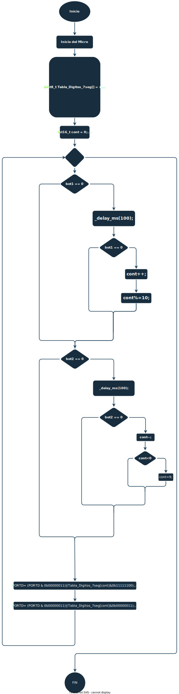

<head>
    <link rel="stylesheet" href="style.css">
</head>
<body>
    <h1 id="Titulo1">
        Informe
    </h1>

<p class="Parrafos">
    Empezamos declarando la variable "Tabla_Digitos_7seg" para crear el vector que se mostrará en nuestro display.    
</p>

<div class="refs">

```C
uint8_t Tabla_Digitos_7seg[] = { 0x3f, 0x06, 0x5B, 0x4f, 0x66, 0x6D, 0x7C, 0x07, 0x7f, 0x67};
```
</div>

<p class="Parrafos">
    Definimos las variables <b class="cont">"cont"</b> para que los datos de una lista de numeros se guarden en el mismo y la variable "i" para poder efectuar el anti-rebote para los <b class="bot">botones</b>.
</p>

<div class="refs">

```C
char cont = 0;
volatile uint32_t i = 0; // este "volatile" antes de de la definición de la variable le indica que al arduino ejecute este proceso en la memoria ram del mismo
``` 

</div>

<p class="Parrafos">
    Ya habiendo terminado de definir las variables que usará nuestro display empezamos a definir nuestro pines de entrada y de salida.
</p>

<div class="refs">

```C
 DDRC &=~(1<<PC0); 
 DDRC &=~(1<<PC1); //Botones
 DDRC &=~(1<<PC2);
 DDRC &=~(1<<PC3);

 PORTC |=(1<<PC0);
 PORTC |=(1<<PC1);
 PORTC |=(1<<PC2); //Resistencias de pull-up
 PORTC |=(1<<PC3); //para los botones
 
 DDRD |=(1<<PD2);
 DDRD |=(1<<PD3); 
 DDRD |=(1<<PD4); 
 DDRD |=(1<<PD5); //Leds
 DDRD |=(1<<PD6);
 DDRD |=(1<<PD7);
 DDRB |=(1<<PB0);
 DDRB |=(1<<PB1);
```

</div>

<p class="Parrafos">
    Empezamos con la parte principal del código el <b id="while">"while"</b> en donde estarán las acciónes que harán los botones.
</p>

<div class="refs">

```C
while(1)
  {
	  if (bot1 == 0)
	  {
		  for (i=0; i<50000; i ++); ////Este "for" es el anti-rebote que se mencionó con anterioridad.
		  if (bot1 == 0)
		  {
			  cont++;
			  cont%=10;
		  }
		  		  
	  }
	  
	  if (bot2 == 0)
	  {
		  for (i=0; i<50000; i ++); 
		  if (bot2 == 0)
		  {
			  cont--;
			  if (cont>0)
			  {
				  cont = 9;
			  }
			  
		  }  
  }
```

</div>

<p class="Parrafos">
    Por último llamamos las las variables definidos anteriormente para mostrar los numeros en el display.
</p>

<div class="refs">

```C
 PORTD &= 0X03;
 PORTD |= Tabla_Digitos_7seg[10]<<2;
 PORTB &= 0XFC;
 PORTB |= (Tabla_Digitos_7seg[10]<<6)&0X01;
```

</div>

<h2 id="Titulo2">
Diagrama de Flujo
</h2>


<div id="img">
    
</div>

</body>
</html>